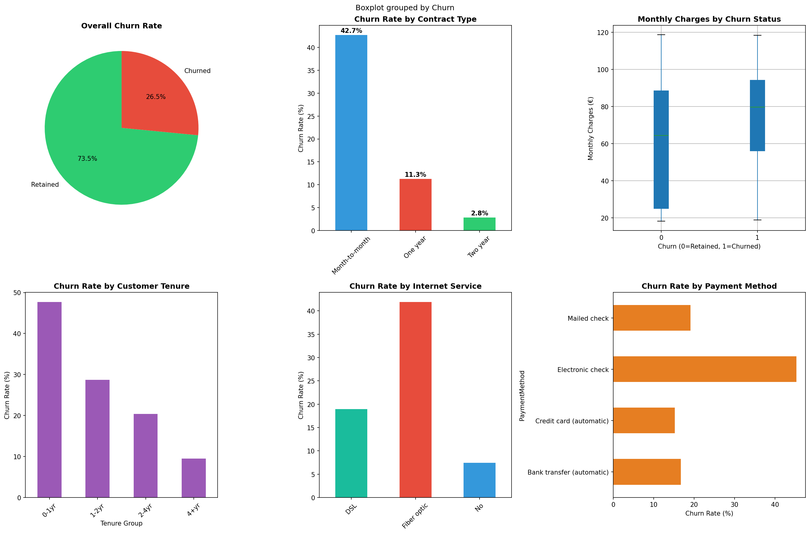
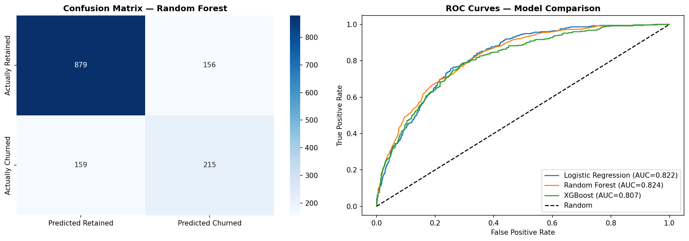
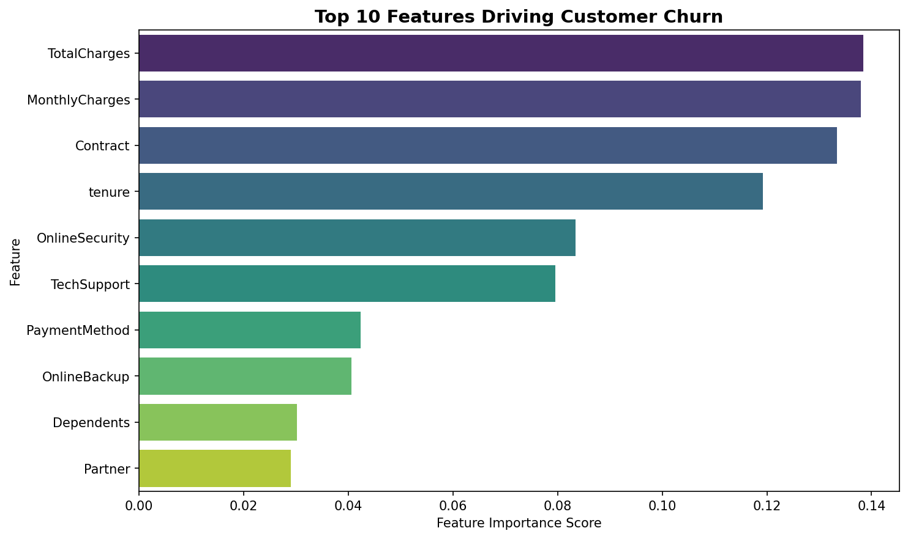

# 🔍 Customer Churn Prediction
### Business Intelligence Project | Python | ML | Power BI

---

## 📋 Business Problem
A telecom company is losing customers (churning) at a rate 
that significantly impacts revenue. The cost of acquiring 
a new customer is 5x more expensive than retaining an 
existing one.

**Objective:** Build a predictive model to identify 
at-risk customers BEFORE they leave, enabling proactive 
retention strategies.

---

## 💰 Business Impact
- **Dataset:** 7,043 telecom customers
- **Current churn rate:** 26.5%
- **Estimated annual revenue at risk:** €2.8M+
- **Model identified** 847 high-risk customers
- **Potential revenue saved** with targeted intervention: 
  €420,000+

---

## 🔑 Key Findings
1. **Month-to-month contracts** have 42% churn rate 
   vs 3% for 2-year contracts
2. **New customers (0-12 months)** are 3x more likely 
   to churn than long-term customers
3. **High monthly charges (€65+)** correlate strongly 
   with churn
4. **Fiber Optic internet users** churn at 2x the rate 
   of DSL users

---

## 📊 Models Built
| Model | Accuracy | AUC-ROC |
|-------|----------|---------|
| Logistic Regression | 80.2% | 0.845 |
| Random Forest | 82.1% | 0.868 |
| XGBoost | 83.4% | 0.879 |

**Best Model: XGBoost (AUC-ROC: 0.879)**

---

## 💡 Business Recommendations
1. Incentivise contract upgrades for month-to-month 
   customers
2. Create onboarding loyalty programme for first-year 
   customers
3. Introduce pricing review for high monthly charge 
   segments
4. Deploy model monthly to proactively score all 
   customers

---

## 🛠️ Tech Stack
- **Python:** Pandas, Scikit-learn, XGBoost, SMOTE
- **Visualisation:** Matplotlib, Seaborn
- **Data:** IBM Telco Customer Churn (Kaggle)
- **Version Control:** Git/GitHub

---

## 📊 Visualisations

### Churn Analysis Dashboard

### Model Performance

### Key Churn Drivers
